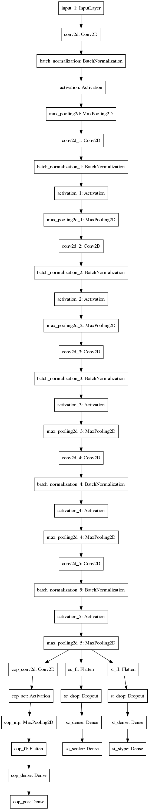
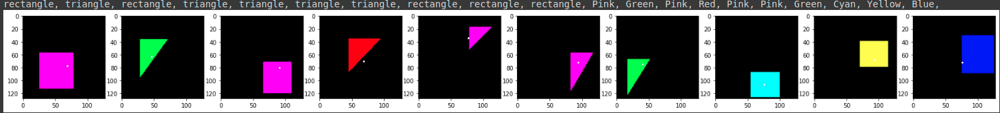
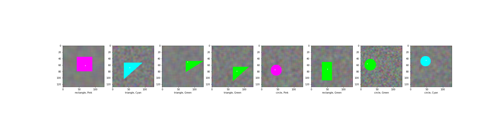
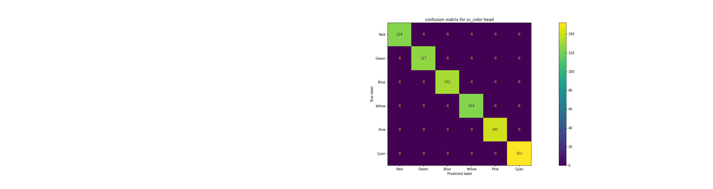
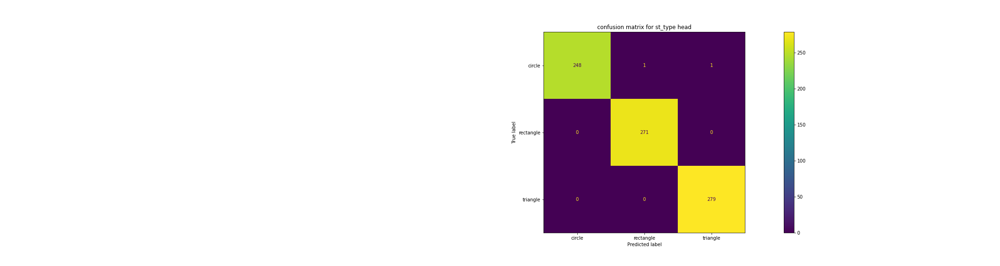

# Multi Task Learning example for shape type, color, position detection

Implementation of a simple multi-task learner with 3 tasks (heads). Shares internal representation between different tasks (hard parameter sharing, see [2]) having the direct benefit of a lighter, faster model with less trainable parameters.

This implementation has ~192 k trainable parameters, compared to ~290 k  used for the same tasks with a multi-headed implementation on separate branches, see [3]. Compared to [3] training samples and epochs are significantly increased, after 2k cycles position accuracy is ~84% while color and shape ~99%.  

#### Steps:

1. Create toy database, generate shapes, color it
2. Normalize the generated images / output values (for the regression head)
3. Create the multi-task learner Keras functional model, train and test it
4. Generate the metrics:
    - mean_absolute_error - regression head
    - confusion matrix, f1-score for classification heads
5. (optional) Freeze the feature detetor part, finetune the regression head
6. reivew the metrics

#### Model:

 
  

#### Outputs:

1. Regression head (position)

 
  

1.1. Regression head (position), after fine-tuning:

 
  

2. Color prediction head Confusion Matrix

 
  

3. Shape type prediction head Confusion Matrix

 
  

## Links

1. [keras](https://keras.io/)
2. [An Overview of Multi-Task Learning in Deep Neural Networks, arXiv:1706.05098 [cs.LG] ](https://arxiv.org/abs/1706.05098)
3. [Multi headed DNN predictor, detects object coordinates, color and shape type](https://github.com/fvilmos/shape_color_position_detection)

/Enjoy.
